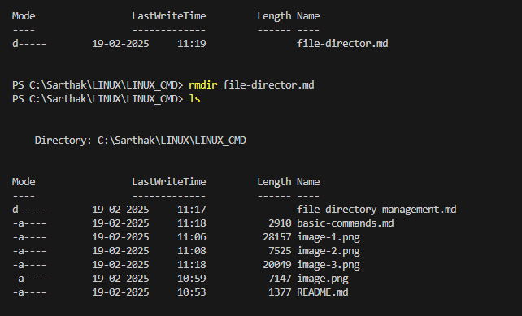

pwd: Print Working Directory

Description
The pwd command stands for "print working directory." It displays the full path of the current directory you are working in.

Practice
Open your terminal.
Navigate to different directories using the cd command.
Use the pwd command to print the current directory path.
Repeat the steps to get comfortable with navigating the file system.

Example
$ pwd
/home/user

---------------------------------------------------------------------------------------------------------------------------------------------------------------------------------

ls: List Directory Contents

Description
The ls command lists files and directories within the current directory.

ERROR

The error message you're encountering is because the parameter name 'a' is ambiguous when using the Get-ChildItem cmdlet in PowerShell. This happens because 'a' could refer to multiple parameters like 

-Attributes, -Directory, -File, -Hidden, -ReadOnly, or -System.

To resolve this issue, you need to use the full name of the parameter you intend to specify. Here's an example of how to use the Get-ChildItem cmdlet with the full parameter names:

Example
$ ls -l
total 4
drwxrwxr-x 2 user user 4096 Feb 19 05:18 example-directory
-rw-rw-r-- 1 user user    0 Feb 19 05:18 example-file.txt

Practice
Open your terminal.
Navigate to different directories using the cd command.
Use the ls command with various options to list directory contents.
Observe the differences in output with different options.

---------------------------------------------------------------------------------------------------------------------------------------------------------------------------------

cd: Change Directory

Description
The cd command changes the current directory to the specified directory.

Usage
cd [directory]

Example
$ cd /home/user/documents
$ pwd
/home/user/documents

Practice
Open your terminal.
Use the cd command to navigate to different directories.
Use the pwd command to verify your current directory.
Practice navigating to both absolute and relative paths.

---------------------------------------------------------------------------------------------------------------------------------------------------------------------------------

mkdir: Make Directories

Description
The mkdir command creates a new directory.

Usage
mkdir [options] directory_name

create a filder

Common Options
-p: Create parent directories as needed

Example
$ mkdir new_directory
$ ls
new_directory

Practice
Open your terminal.
Use the mkdir command to create new directories.
Verify the creation of directories using the ls command.
Practice creating nested directories using the -p option.

---------------------------------------------------------------------------------------------------------------------------------------------------------------------------------

rmdir: Remove Empty Directories

Description
The rmdir command removes an empty directory.

Usage
rmdir directory_name

Example
$ rmdir empty_directory
$ ls
(empty directory is removed)

Practice
Open your terminal.
Use the mkdir command to create an empty directory.
Use the rmdir command to remove the empty directory.
Verify the removal of the directory using the ls command.

---------------------------------------------------------------------------------------------------------------------------------------------------------------------------------

rm: Remove Files or Directories

Description
The rm command removes files or directories.

Usage
rm [options] file_name
Common Options
-r: Remove directories and their contents recursively
-f: Force removal without prompting for confirmation

Example
$ rm file_name
$ ls
(file is removed)

$ rm -r directory_name
$ ls
(directory and its contents are removed)

Practice
Open your terminal.
Use the rm command to remove files.
Use the rm -r command to remove directories and their contents.
Verify the removal of files and directories using the ls command.

---------------------------------------------------------------------------------------------------------------------------------------------------------------------------------

cp: Copy Files or Directories

Description
The cp command copies files or directories from one location to another.

Usage
cp [options] source destination
Common Options
-r: Copy directories recursively

Example
$ cp source_file destination_file
$ ls
(source_file and destination_file exist)

$ cp -r source_directory destination_directory
$ ls
(source_directory and destination_directory exist)

Practice
Open your terminal.
Use the cp command to copy files.
Use the cp -r command to copy directories and their contents.
Verify the copying of files and directories using the ls command.